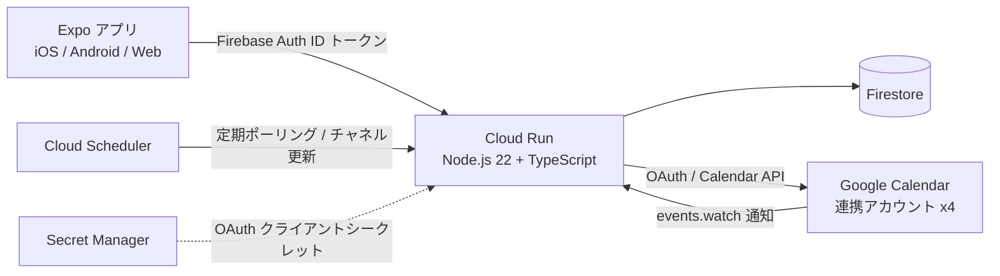

# カレンダー連携アプリ 要件定義・設計

最終更新: 2026-09-23

## 1. 目的

複数の Google アカウント（Google Workspace アカウント 3 つ程度 + 個人の Google アカウント 1 つ）のカレンダーを連携し、
あるアカウントに入った予定を、他のアカウントのカレンダーに **「不在（Out of office）」または「予定あり」の予定として自動で反映する**。

参考アプリは [Lynx（lynxcat）](https://lynxcat.app/)。Lynx は複数アカウントの空き時間を相互に同期できるが、
同期先に作られるのは通常の「予定あり」のみで、**「不在」は作れない**。本アプリはそこを差別化ポイントとする。

「不在」は Google Workspace の機能で、重なる会議の招待を自動辞退できる。
例: アカウント A に Meet 付きの会議が入ったら、アカウント B のカレンダーに同じ時間帯の「不在」を入れ、B 宛ての招待を自動辞退する。

## 2. 用語

| 用語           | 意味                                                                                                  |
| -------------- | ----------------------------------------------------------------------------------------------------- |
| 連携アカウント | OAuth で本アプリに接続した Google アカウント。Workspace か個人かを区別する                            |
| 同期設定       | 「送信元アカウント（のカレンダー）→ 同期先アカウント」の 1 方向のルール。フィルタ条件と出力設定を持つ |
| ミラー予定     | 同期設定によって同期先カレンダーに作成される予定（「不在」または「予定あり」）                        |
| 元予定         | ミラー予定の作成元となった送信元カレンダーの予定                                                      |

## 3. 決定事項（2026-09-23 時点）

ユーザー確認済み:

- 同期は **自動ミラーのみ**。アプリから手動で「不在」を作る機能は作らない
- 同期先に作る種別（「不在」/「予定あり」）は **同期設定ごとに選べる**。ただし個人アカウント宛ては「不在」を作れないため、UI で「予定あり」のみに制限する
- 同期のトリガー条件（どの予定を同期するか）は **同期設定ごとに細かく設定できる**（キーワード除外、複数人の予定のみ、など）
- 同期先に見せる内容（タイトルなど）も **同期設定ごとに設定できる**
- 自動辞退の既定値は **「新規の招待のみ辞退」**
- アカウント連携は参考アプリと同様に、アプリ内の「Google アカウントを追加」から OAuth で行う
- 同期を常時動かすための **バックエンドを持つ**
- **連携の方向と設定は、アカウントの組み合わせごと・方向ごとに個別に設定できる**。「A → B」と「B → A」は別々の同期設定で、フィルタ条件と出力設定もそれぞれ独立している。片方向だけの連携もできる

Claude 側で決めた事項（異論があれば変更する）:

- バックエンドは Google Cloud に置く。Cloud Run（Node.js 22 + TypeScript）、Firestore、Cloud Scheduler、Secret Manager。
  理由: OAuth クライアントと Calendar API が同じ GCP プロジェクトに収まり、ベンダーが増えない。個人利用なら無料枠で収まる
- アプリ（Expo）からバックエンドへのログインは Firebase Authentication（Google サインイン）。バックエンド側で許可メールアドレスを固定し、他人は使えないようにする
- リポジトリ構成は Expo アプリをルートに残し、`server/` ディレクトリにバックエンドを追加する（Expo / EAS のツールがルート前提のため）
- 繰り返し予定は、インスタンス（各回）ごとに個別のミラー予定を作る（`singleEvents=true` で展開）。更新・削除の追従が単純になる
- 同期先で手動削除されたミラー予定は、次回の整合性チェックで再作成する（ミラーを止めたい場合は同期設定のフィルタで除外する）

## 4. 機能要件

### F1. アカウント連携

- 「Google アカウントを追加」で OAuth 同意画面を開き、連携する。複数回繰り返して 4 アカウント以上を連携できる
- 連携時に Workspace か個人かを判定して保存する（ID トークンの `hd` クレームの有無で判定）
- 連携アカウントの一覧表示、再認証（トークン失効時）、連携解除ができる
- 連携解除時は、そのアカウントが関係する同期設定を無効化し、そのアカウントに作成済みのミラー予定を削除するか確認する
- 要求する OAuth スコープ:
  - `https://www.googleapis.com/auth/calendar.events`（予定の読み書き）
  - `https://www.googleapis.com/auth/calendar.calendarlist.readonly`（カレンダー一覧）
  - `openid` `email`（アカウント識別）

### F2. 同期設定

1 つの同期設定 = 1 方向（送信元 → 同期先）。連携の方向と設定は、アカウントの組み合わせごと・方向ごとに独立している。

- 「A → B」と「B → A」は別々の同期設定として持ち、フィルタ条件と出力設定もそれぞれ独立して設定できる
  （例: A → B は Meet 付きの予定だけを「不在」に、B → A は全予定を「予定あり」に）
- 片方向だけの連携もできる（「A → B」だけ作り、「B → A」は作らない）
- 「逆方向も作る」ショートカットは、現在の設定を初期値としてコピーした別の同期設定を作るだけで、作成後は独立して編集できる
- 同じ送信元と同期先の組み合わせの同期設定は 1 件まで（重複を防ぐ）

| 項目         | 内容                                                                                               |
| ------------ | -------------------------------------------------------------------------------------------------- |
| 名前         | 任意。既定は「A → B」                                                                              |
| 有効 / 無効  | 無効にするとミラー予定を削除するか確認する                                                         |
| 送信元       | アカウント + 対象カレンダー（メインカレンダー + 任意のサブカレンダー）                             |
| 同期先       | アカウント。同期先カレンダーはメインカレンダー固定（「不在」はメインカレンダーにしか作れないため） |
| 同期範囲     | 今日から何日先まで同期するか（30 / 60 / 90 日。既定 60 日）                                        |
| フィルタ条件 | F3 参照                                                                                            |
| 出力設定     | F4 参照                                                                                            |

### F3. フィルタ条件（どの元予定を同期するか）

すべて同期設定ごとに指定する。条件は AND で評価する。

| 条件             | 内容                                                                      | 既定     |
| ---------------- | ------------------------------------------------------------------------- | -------- |
| 参加者数         | 参加者が N 人以上の予定のみ（自分を含む）。「複数人の予定のみ」は N=2     | 条件なし |
| 会議リンク       | Google Meet などの会議リンクがある予定のみ                                | 条件なし |
| 除外キーワード   | タイトルにいずれかを含む予定は除外する（説明文は見ない。2026-09-23 変更） | なし     |
| 包含キーワード   | 指定した場合、タイトルまたは説明にいずれかを含む予定のみ同期する          | なし     |
| 終日予定         | 終日の予定を除外する                                                      | 除外する |
| 「予定なし」扱い | 時間を空けない設定（transparent）の予定を除外する                         | 除外する |
| 辞退した予定     | 自分が辞退した予定を除外する                                              | 除外する |
| 未回答 / 仮承諾  | 返答していない、または仮承諾の予定を含める                                | 含める   |

共通ルール（設定不可）:

- 本アプリが作成したミラー予定は、どの同期設定でも元予定として扱わない（ミラーのミラーが増え続けるのを防ぐ）
- キャンセルされた元予定に対応するミラー予定は削除する

### F4. 出力設定（同期先にどう見せるか）

| 項目                       | 内容                                                                                                                          | 既定                                      |
| -------------------------- | ----------------------------------------------------------------------------------------------------------------------------- | ----------------------------------------- |
| 種別                       | 「不在」（outOfOffice）または「予定あり」（通常の予定、時間を空けない）。同期先が個人アカウントの場合は「予定あり」のみ選択可 | Workspace 宛て: 不在 / 個人宛て: 予定あり |
| タイトル                   | 固定文言、または `{title}` `{account}` を使えるテンプレート                                                                   | 「不在」または「予定あり」                |
| 説明を写す                 | 元予定の説明文をコピーするか                                                                                                  | しない                                    |
| 場所・会議リンクを写す     | 元予定の場所と会議リンクをコピーするか                                                                                        | しない                                    |
| 公開設定                   | 公開（public）/ 非公開（private）/ 同期先カレンダーの既定（2026-09-23 変更: 既定を公開に）                                    | 公開                                      |
| 予定の色                   | 同期先の Google カレンダーでの予定の色（11 色から選択）。既定はカレンダーの既定の色（2026-09-23 追加）                        | カレンダーの既定                          |
| 終日の元予定の扱い         | 「不在」は終日にできないため、その日の 0:00〜24:00 の時間指定に変換する、または同期しない                                     | 変換する                                  |
| 自動辞退（不在のみ）       | 辞退しない / 新規の招待のみ辞退 / 既存も含めて全て辞退                                                                        | 新規の招待のみ辞退                        |
| 辞退メッセージ（不在のみ） | 自動辞退時に相手へ送る文面                                                                                                    | 「別件の予定があるため参加できません。」  |

### F5. 同期エンジン

- 同期設定の作成・変更時に、同期範囲内の全件同期を行う
- 以降は差分同期を行う。Google の `events.watch`（変更のプッシュ通知）を受けて即時に同期し、
  Cloud Scheduler による定期ポーリング（10 分間隔程度）を保険にする
- 差分取得には `events.list` の `syncToken` を使う。無効化（410 Gone）された場合は全件同期に切り替える
- ミラー予定には、元予定を特定するタグ（`extendedProperties.private`）を埋め込む。あわせて Firestore に対応表を持つ
- 元予定の更新（時間・タイトルなど）はミラー予定に反映し、削除・キャンセルはミラー予定の削除に反映する
- 同期設定のフィルタや出力設定が変わったら、範囲内を再評価し、条件から外れたミラー予定は削除する
- 同期範囲から外れた過去のミラー予定はそのまま残す（履歴として扱う）
- `events.watch` のチャネルは有効期限があるため、期限前に更新する（Cloud Scheduler）
- API エラーは指数バックオフで再試行する。トークン失効はアカウントを「再認証が必要」にし、アプリで表示する

### F6. 統合カレンダー表示

- 連携している全アカウントの予定を 1 つのカレンダーに重ねて表示する（アカウントごとに色分け）
- ミラー予定は見分けがつく表示にする（薄い色、アイコンなど）
- 表示のみ。予定の作成・編集はしない

### F7. 状態表示・エラー

- 同期設定ごとに最終同期日時、直近のエラーを表示する
- 再認証が必要なアカウントを一覧で強調表示する

## 5. 非機能要件

- 利用者は 1 名（本人）。将来の複数ユーザー対応を妨げない設計にするが、優先はしない
- リフレッシュトークンは Firestore に保存し、バックエンドのサービスアカウントからのみ読める（クライアントからの直接アクセスは Firestore ルールで禁止）
- OAuth クライアントシークレットは Secret Manager に置き、リポジトリや chat には書かない
- タイムゾーンは各カレンダーの設定を尊重する（既定は Asia/Tokyo）
- Google Calendar API のクォータは個人利用の範囲では問題にならない見込み

## 6. アーキテクチャ



### 6.1 コンポーネント

| コンポーネント                    | 役割                                                                |
| --------------------------------- | ------------------------------------------------------------------- |
| Expo アプリ（リポジトリのルート） | アカウント連携の起点、同期設定の編集、統合カレンダー表示、状態表示  |
| Cloud Run（`server/`）            | OAuth コールバック、REST API、同期エンジン、`events.watch` の受け口 |
| Firestore                         | 連携アカウント、同期設定、ミラー対応表、watch チャネル情報          |
| Cloud Scheduler                   | 定期ポーリングとチャネル更新のトリガー                              |
| Secret Manager                    | OAuth クライアントシークレット                                      |
| Firebase Authentication           | アプリ利用者のログイン（Google サインイン）                         |

### 6.2 ログインとアカウント連携の流れ

ログインも連携も、ブラウザで Google の同意画面を開いてバックエンドのコールバックに戻る方式にする。
iOS / Android 用の OAuth クライアントを作らずに、ウェブ用クライアント 1 つで済ませるため。

#### ログイン（アプリ利用者の本人確認）

1. アプリが `/auth/login/start?return_to=<アプリの URL>` をブラウザで開く。`return_to` は許可した先頭文字列（`mycalendarapp://`、`exp://`、`http://localhost`）のものだけ受け付ける
2. Google でアカウントを選ぶと `/auth/google/callback` に戻る。バックエンドはメールアドレスを `OWNER_EMAILS` と照合し、本人なら Firebase のカスタムトークンを発行する
3. `return_to?token=<カスタムトークン>` にリダイレクトし、アプリは `signInWithCustomToken` でログインする。以降の API 呼び出しには Firebase の ID トークンを付ける

#### アカウント連携

1. アプリが認証付きで `POST /api/accounts/link` を呼び、返された同意画面の URL をブラウザで開く（`access_type=offline`、`prompt=consent`）
2. 連携したいアカウントで許可すると `/auth/google/callback` に戻る。バックエンドは認可コードをトークンに交換し、リフレッシュトークンを暗号化して Firestore に保存、`hd` の有無で Workspace / 個人を判定し、カレンダー一覧を取得する
3. `return_to?linked=<email>` にリダイレクトする。アプリはアカウント一覧を再取得する

CSRF 対策として、開始時に発行した `state` を Firestore に保存し、コールバックで 1 回だけ消費する（有効期間 10 分）。
トークンをアプリ側で扱わないため、Expo Go でも動作し、スマホにトークンが残らない。

### 6.3 データモデル（Firestore）

```text
users/{uid}
  email, createdAt

users/{uid}/accounts/{accountId}
  email, hd, type: "workspace" | "personal",
  refreshToken, scopes, status: "ok" | "reauth_required",
  timezone, calendars: [{ id, summary, primary }], linkedAt

users/{uid}/rules/{ruleId}
  name, enabled,
  source: { accountId, calendarIds: [] },
  target: { accountId },
  windowDays,
  filters: { minAttendees, requireMeetLink, excludeKeywords: [], includeKeywords: [],
             excludeAllDay, excludeTransparent, excludeDeclined, includeTentative },
  output:  { kind: "outOfOffice" | "busy", title, copyDescription, copyLocation,
             visibility, allDaySourceHandling: "fullDay" | "skip",
             autoDeclineMode, declineMessage },
  lastSyncAt, lastError

users/{uid}/mirrors/{mirrorId}
  ruleId, sourceAccountId, sourceCalendarId, sourceEventId,
  targetAccountId, targetEventId, fingerprint, updatedAt

users/{uid}/accounts/{accountId}/watch/{calendarId}
  channelId, resourceId, expiration, syncToken
```

### 6.4 同期設定の例

```json
{
  "name": "会社A → 会社B",
  "enabled": true,
  "source": { "accountId": "acc_a", "calendarIds": ["primary"] },
  "target": { "accountId": "acc_b" },
  "windowDays": 60,
  "filters": {
    "minAttendees": 2,
    "requireMeetLink": false,
    "excludeKeywords": ["仮", "移動"],
    "includeKeywords": [],
    "excludeAllDay": true,
    "excludeTransparent": true,
    "excludeDeclined": true,
    "includeTentative": true
  },
  "output": {
    "kind": "outOfOffice",
    "title": "不在",
    "copyDescription": false,
    "copyLocation": false,
    "visibility": "public",
    "allDaySourceHandling": "fullDay",
    "autoDeclineMode": "declineOnlyNewConflictingInvitations",
    "declineMessage": "別件の予定があるため参加できません。"
  }
}
```

### 6.5 同期アルゴリズム（同期設定 1 件あたり）

1. 送信元カレンダーごとに `events.list` を呼ぶ。`syncToken` があれば差分、なければ `timeMin=今` `timeMax=今+windowDays` で全件（`singleEvents=true`）
2. 取得した各予定について
   - 本アプリのタグ付き（ミラー予定）なら無視する
   - F3 のフィルタを評価して「同期対象か」を決める
   - 対応表を引く
     - 対応なし かつ 同期対象 → 同期先に作成し、対応表に追加する
     - 対応あり かつ 同期対象 → 内容のフィンガープリントを比較し、変わっていれば更新する
     - 対応あり かつ 同期対象外（キャンセル含む） → 同期先から削除し、対応表から消す
3. 新しい `syncToken` を保存する。410 Gone なら `syncToken` を破棄して全件同期に戻り、対応表にあるのに元予定が無いミラー予定を削除する（孤児の掃除）

「不在」を作成する API 呼び出しの要点:

- `eventType: "outOfOffice"`、`transparency: "opaque"`、`outOfOfficeProperties: { autoDeclineMode, declineMessage }`
- 時間指定が必須（終日不可）。作成先はメインカレンダーのみ。Workspace アカウントのみ
- `extendedProperties.private` に `app`, `ruleId`, `sourceAccountId`, `sourceEventId` を入れる

### 6.6 バックエンド API（案）

| メソッド                  | パス                                | 用途                                                  |
| ------------------------- | ----------------------------------- | ----------------------------------------------------- |
| GET                       | `/auth/google/start`                | アカウント連携の開始（同意画面へリダイレクト）        |
| GET                       | `/auth/google/callback`             | OAuth コールバック                                    |
| GET / DELETE              | `/api/accounts` `/api/accounts/:id` | 連携アカウントの一覧・解除                            |
| GET / POST / PUT / DELETE | `/api/rules` `/api/rules/:id`       | 同期設定の CRUD                                       |
| POST                      | `/api/rules/:id/sync`               | 手動で同期を実行                                      |
| GET                       | `/api/events?from&to`               | 統合カレンダー表示用の予定取得                        |
| POST                      | `/webhooks/calendar`                | `events.watch` の通知受け口                           |
| POST                      | `/tasks/poll` `/tasks/renew-watch`  | Cloud Scheduler からの定期実行（OIDC トークンで保護） |

### 6.7 アプリの画面

| 画面       | 内容                                                                                                                                                                               |
| ---------- | ---------------------------------------------------------------------------------------------------------------------------------------------------------------------------------- |
| ログイン   | Firebase Authentication で Google サインイン                                                                                                                                       |
| カレンダー | 統合カレンダー表示（F6）。現在の `calendar.tsx` を発展させる                                                                                                                       |
| アカウント | 連携アカウント一覧、追加、再認証、解除                                                                                                                                             |
| 同期設定   | 一覧はアカウントの組み合わせごとに「A → B」「B → A」を並べて表示し、方向ごとに有効 / 無効と設定を個別に編集できる。編集フォームは F2〜F4。同期先が個人なら種別を「予定あり」に固定 |
| 設定       | ログアウト、バージョン情報                                                                                                                                                         |

## 7. 開発フェーズ

各フェーズはブランチを切って develop への PR にする。

| フェーズ          | 内容                                                                       | 完了条件                                                         |
| ----------------- | -------------------------------------------------------------------------- | ---------------------------------------------------------------- |
| 0. 準備           | GCP / Firebase の設定（第 8 章）、`server/` の雛形、環境変数の整理         | ローカルでバックエンドが起動し、ヘルスチェックが通る             |
| 1. アカウント連携 | OAuth 連携フロー、アカウント一覧画面、Firebase ログイン                    | 4 アカウントを連携・解除でき、Workspace / 個人が正しく判定される |
| 2. 同期設定       | 同期設定の CRUD（API + 画面）                                              | 同期設定を作成・編集・削除できる                                 |
| 3. 同期エンジン   | 全件同期、差分同期、`events.watch`、Scheduler、「不在」/「予定あり」の作成 | A の予定が B に「不在」として反映され、更新・削除も追従する      |
| 4. 仕上げ         | 統合カレンダー表示、状態・エラー表示、Cloud Run へのデプロイ手順           | 日常的に使える状態                                               |

## 8. ユーザー側で準備してもらうこと（フェーズ 0）

Claude からは操作できないため、以下を Google Cloud / Firebase のコンソールで実施してほしい。
シークレットは chat に貼らず、ローカルの `.env` と Secret Manager に入れる。

1. Google Cloud プロジェクトを作成する（リージョンは `asia-northeast1` を想定）
2. 「Google Calendar API」を有効にする
3. OAuth 同意画面を設定する
   - ユーザーの種類: 外部
   - スコープ: `calendar.events` と `calendar.calendarlist.readonly`
   - テストユーザーに連携予定の 4 アカウントを登録する
   - 注意: 公開ステータスが「テスト」のままだとリフレッシュトークンが 7 日で失効し、毎週再連携が必要になる。
     動作確認後は「本番」に切り替える（未検証アプリの警告画面は出るが動作する）。長期的には検証申請を検討する
4. OAuth クライアント ID を作成する（種類: ウェブアプリケーション）。承認済みリダイレクト URI にバックエンドの `/auth/google/callback` を登録する
   （ローカル開発用に `http://localhost:8080/auth/google/callback` も登録する）
5. 同じ GCP プロジェクトに Firebase を追加し、Authentication（Google）と Firestore（ネイティブモード、`asia-northeast1`）を有効にする
6. Cloud Run と Cloud Scheduler の API を有効にする（請求先アカウントの紐付けが必要。無料枠内で収まる想定）
7. 各 Workspace の管理者設定で、本アプリの OAuth クライアント ID が「信頼済み」として扱われるか確認する
   （Lynx は検証済みアプリのため通っている可能性がある。未検証アプリをブロックする設定の組織では連携できない）
8. Claude に共有するもの: プロジェクト ID、OAuth クライアント ID（シークレットは不要）、Firebase の Web 設定（apiKey などの公開情報）

## 9. リスクと対策

| リスク                                                          | 対策                                                                                                            |
| --------------------------------------------------------------- | --------------------------------------------------------------------------------------------------------------- |
| Workspace 管理者が未検証アプリをブロックしている                | 早めに 1 アカウントで連携を試す。ブロックされる場合は管理者にクライアント ID の許可を依頼するか、検証申請を行う |
| OAuth の「テスト」ステータスでトークンが 7 日で失効する         | 動作確認後に「本番」へ切り替える                                                                                |
| `events.watch` のチャネルが失効して通知が止まる                 | Scheduler で期限前に更新し、定期ポーリングを保険にする                                                          |
| 「不在」を個人アカウントや サブカレンダーに作ろうとして失敗する | 同期設定の UI とバックエンドの両方で禁止する                                                                    |
| 繰り返し予定の一部変更・削除                                    | インスタンス単位でミラーするため、通常の更新・削除として扱える                                                  |
| 同じ元予定が複数の同期設定で同期先に重複する                    | 同期設定ごとに別のミラー予定として扱う（意図どおり）。同一の送信元と同期先の組み合わせは 1 件に制限する         |

## 10. 未決事項

- 統合カレンダー表示（F6）を初期リリースに含めるか、フェーズ 4 に回すか
- 勤務時間内の予定だけを同期するフィルタを追加するか（要望があれば F3 に追加）
